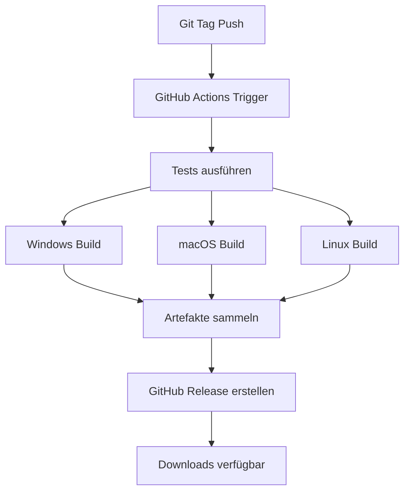

# 🚀 Release-System für Finanzauswertung Ehrenamt

## Übersicht
Das automatische Release-System erstellt bei jedem Git-Tag automatisch ein GitHub Release mit allen Build-Artefakten für Windows, macOS und Linux.

## 📋 Wie man ein Release erstellt

### 1. Lokales Tag erstellen
```bash
# Version 1.0.0 Release erstellen
git tag release_1.0.0
git push origin release_1.0.0

# Oder mit v-Prefix (beide Formate werden unterstützt)
git tag v1.0.0
git push origin v1.0.0
```

### 2. Automatischer Build-Prozess
Nach dem Push des Tags startet automatisch:
- ✅ Tests auf Ubuntu
- 🏗️ Cross-Platform Builds (Windows .exe, macOS .app, Linux executable)
- 📦 Erstellung von Download-Artefakten
- 🚀 Automatisches GitHub Release

### 3. Release-Downloads
Das erstellte Release enthält:
- **Windows:** `Finanzauswertung_Ehrenamt.exe`
- **macOS:** `Finanzauswertung_Ehrenamt.app`  
- **Linux:** `Finanzauswertung_Ehrenamt`

## 🔧 Unterstützte Tag-Formate

| Format | Beispiel | Beschreibung |
|--------|----------|--------------|
| `release_X.Y.Z` | `release_1.0.0` | Standard Release-Format |
| `vX.Y.Z` | `v1.0.0` | Traditionelles Versioning |
| `release_X.Y.Z-beta` | `release_1.1.0-beta` | Beta-Releases |

## 📊 Workflow-Übersicht



## 🛠️ Build-Matrix

| Platform | OS | Executable | Icon |
|----------|-----|------------|------|
| Windows | windows-latest | `.exe` | `.ico` |
| macOS | macos-latest | `.app` | `.icns` |
| Linux | ubuntu-latest | executable | `.png` |

## 📝 Release-Notizen
Jedes Release enthält automatisch:
- 📦 Download-Links für alle Plattformen
- ✨ Feature-Liste der Anwendung
- 🚀 Installationsanleitungen
- 🔖 Tag-Informationen
- 💻 Build-Details

## 🔍 Troubleshooting

### Release wird nicht erstellt?
1. **Tag-Format prüfen:** Muss `release_*` oder `v*` sein
2. **Tests fehlgeschlagen:** Prüfe GitHub Actions Logs
3. **Build-Fehler:** Einzelne Platform-Builds in den Logs prüfen

### Artefakte fehlen?
1. **Build-Logs prüfen:** Siehe GitHub Actions Tab
2. **Permissions:** `GITHUB_TOKEN` muss Release-Berechtigung haben
3. **Retry:** Tag löschen und neu erstellen

## 📈 Versioning-Strategie

### Empfohlenes Schema:
- **Major:** `release_1.0.0` → `release_2.0.0` (Breaking Changes)
- **Minor:** `release_1.0.0` → `release_1.1.0` (Neue Features)
- **Patch:** `release_1.0.0` → `release_1.0.1` (Bugfixes)

### Beta-Releases:
```bash
git tag release_1.1.0-beta
git push origin release_1.1.0-beta
```

## 🔄 Release-Workflow Commands

```bash
# 1. Neues Release vorbereiten
git checkout main
git pull origin main

# 2. Version updaten (optional - in Code)
# Beispiel: __version__ = "1.0.0" in main.py

# 3. Tag erstellen und pushen
git tag release_1.0.0
git push origin release_1.0.0

# 4. Release verfolgen
# → GitHub Actions Tab beobachten
# → Release-Seite nach ~10-15 Minuten prüfen
```

## 🎯 Nächste Schritte

1. **Erstes Release:** `git tag release_1.0.0 && git push origin release_1.0.0`
2. **Release testen:** Downloads aus GitHub Release testen
3. **Dokumentation:** README.md mit Download-Links updaten
4. **Automatisierung:** Weitere Release-Automatisierungen hinzufügen

---

*Automatisch generiert durch das CI/CD-System* 🤖
